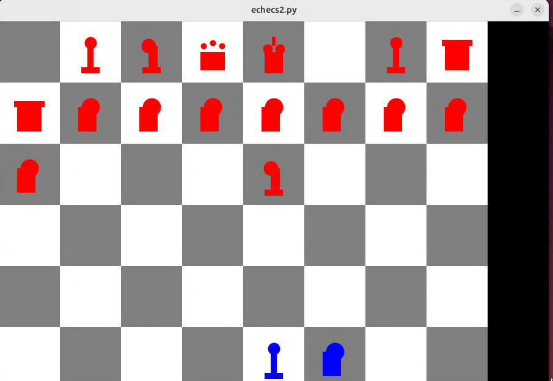

# Chess-Game-Python
A chess game developed during my first year of Computer Science studies
## Description
This progect implements a graphical chess game in Python.

The chessboard is represented using matrices and qtido graphic library implemented functions, snf the game logic is imp;emented through custom functions for piece management, board updates, move validation, and graphical redering.
## Features
- Graphical chessboard display
- Graphical representation of chess pieces
- Matirx-based board representation
- Piece movement management
- Move validation
- Board state updates
- Keyboard controls
- Multiple game turns
## Programming language and librarys
- Python
- qtido graphical library
- numpy
## Porject Structure
The program is organized into mutiple functions responsible for:
- Board initialization
- Board rendering
- Piece redering
- Move validation
- Board updates
- User interaction
## Current Status
The project is functional and playable.
Some bugs remain in the mouse-control mode, which is still under development.
## Future improvements
- Improve mouse controls
- Add check detection
- Add checkmate detection
- Improve user interface
- Refactor code structure
## Learning Objectives
This project was developend to practice:
- Alogorithms
- Data structures
- Matrix manipulation
- Function decomposition
- Graphical programming
- Game logic implementaion
## Screenshot

## Authon
Said Hamlat
Computer Science Student
Jean Monnet University
